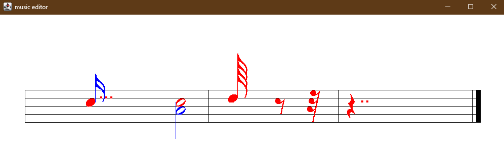

# Gesture Based Music Notation System  
## Author: Andrew Moran  

This project created a program that allows the user to write music notation through a series of predefined simple gestures. It uses a bidding system based on the type of gesture and location of the gesture on the screen to discern what notation the user intended. This project represents approximately 70 to 80 hours of time spent programming over a semester.

This project was completed as part of an intermediate Java course created and taught by Prof. Marlin Eller.
[Intermediate Java Course](https://depts.washington.edu/cprogs/BCS/Books/BCS_MidJava.html)
